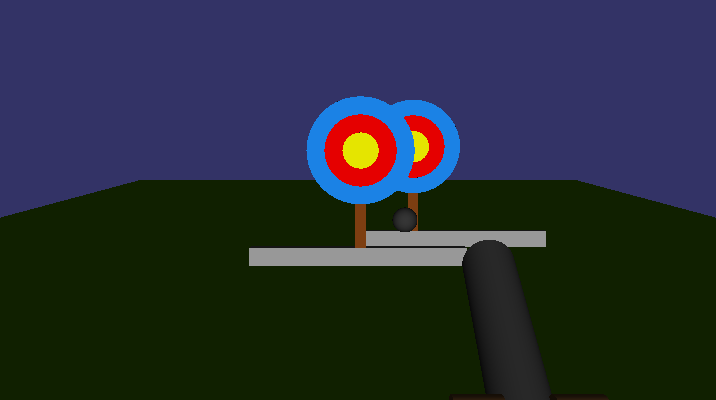
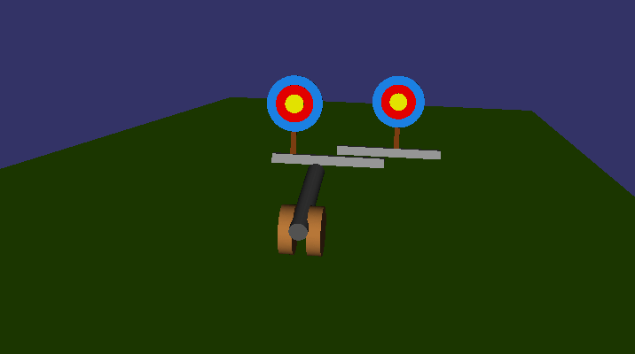

# Shooting to targets 

This program is supposed to be some example of OSG library use. 

## Running program
1. Compile code using ``` make ```
2. Run it ``` ./program ```

## Modes
Program offers 2 camera modes:
1. Locked - ``` ./program -l ```


2. Unlocked ``` ./program ```
